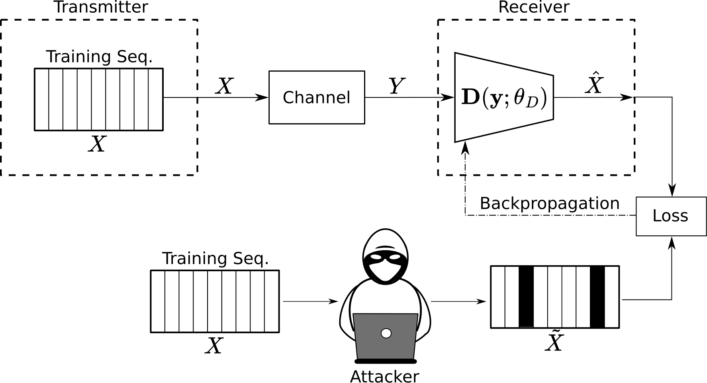

<div align="center">
  
# Label Noise Resistant $f$-Divergence Receiver<br /> for Power Line Communications

[Nicola Novello](https://scholar.google.com/citations?user=4PPM0GkAAAAJ&hl=en) and [Andrea M. Tonello](https://scholar.google.com/citations?user=qBiseEsAAAAJ&hl=en)
</div>

Official repository of the paper "Label Noise Resistant $f$-Divergence Receiver for Power Line Communications" published at IEEE International Conference on Communications, Control, and Computing Technologies for Smart Grids (SmartGridComm) 2024.

> Novel class of neural receivers based on the $f$-divergence, with analysis in the presence of label noise. The specific application considered is Power Line Communications. 

---
# 📷 Scenario



---

# 💻 How to run the code

The folder with the scripts must comprise a folder named `Dataset` containing the `.mat` file with the channel measurements.

The file `main.py` runs the experiments:
```
python3 main.py --noisy True --noise_type symm --noise_rate 0.1 
```
where "noisy" must be set to True to run the tests in the presence of label noise. "noise_type" can be: "symm" for symmetric noise, "sparse" for sparse noise, and "unif" for uniform noise. "noise_rate" must be a float with suggested values: 0.1, 0.2. 

The scripts `main_functions.py` and `utils.py` define the functions needed in `main.py`. 

---

## 📝 References

If you use your code for your research, please cite our paper:
```

```
---

## 📋 Acknowledgments

The implementation is based on / inspired by:

- [https://github.com/nicolaNovello/discriminative-classification-fDiv](https://github.com/nicolaNovello/discriminative-classification-fDiv)

---

## 📧 Contact

[nicola.novello@aau.at](nicola.novello@aau.at)
